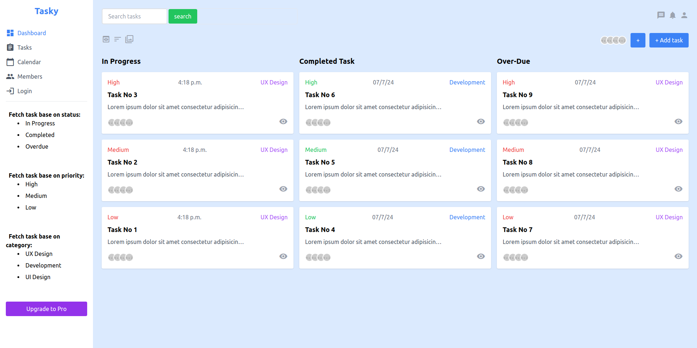
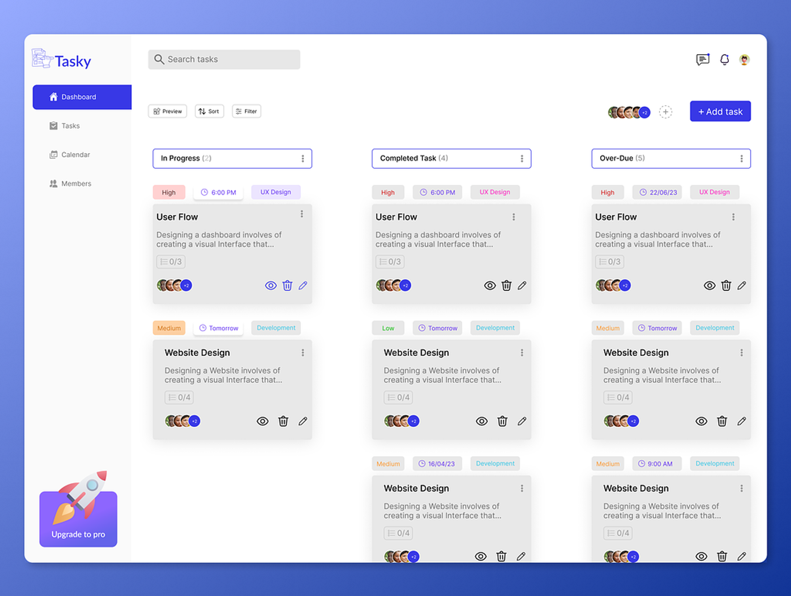

# Tesk management dashboard

This is a task management dashboard project, developed using `Django` `HTML` `TailwindCSS` and `jQuery`

## Setup and run

First clone the github repository by:

```sh
git clone https://github.com/usmanmusa1920/tast-management-dashboard
```

Now, cd into the cloned project directory, and install the dependencies (libraries) which include `django (v5.0.6)`, `djangorestframework (v3.15.2)` and others by:

```sh
pip install -r requirements.txt
```

After that, power on the development server by

```sh
python manage.py runserver
```

Then, visit the application on localhost port 8000 <a href="http://127.0.0.1:8000">http://127.0.0.1:8000</a> so, you can now login using the already user been registered with these credentials:

<b>Username:</b> usman & <b>Password:</b> passwd1234

Or, you can create your own user, and task by:

```sh
python manage.py createsuperuser
```

After that, you should go to python interpreter using django command of:

```sh
python manage.py shell
```

Then copy the entire content of `automate.sh` file in the base directory of the cloned project and paste it in the interpreter, after then login with the new user credentials.

## Screen-shot

Below are two screen shots of dashboard, the first one is the dashboard for this project, while the later is the prototype that I was insisted to design (sample)




